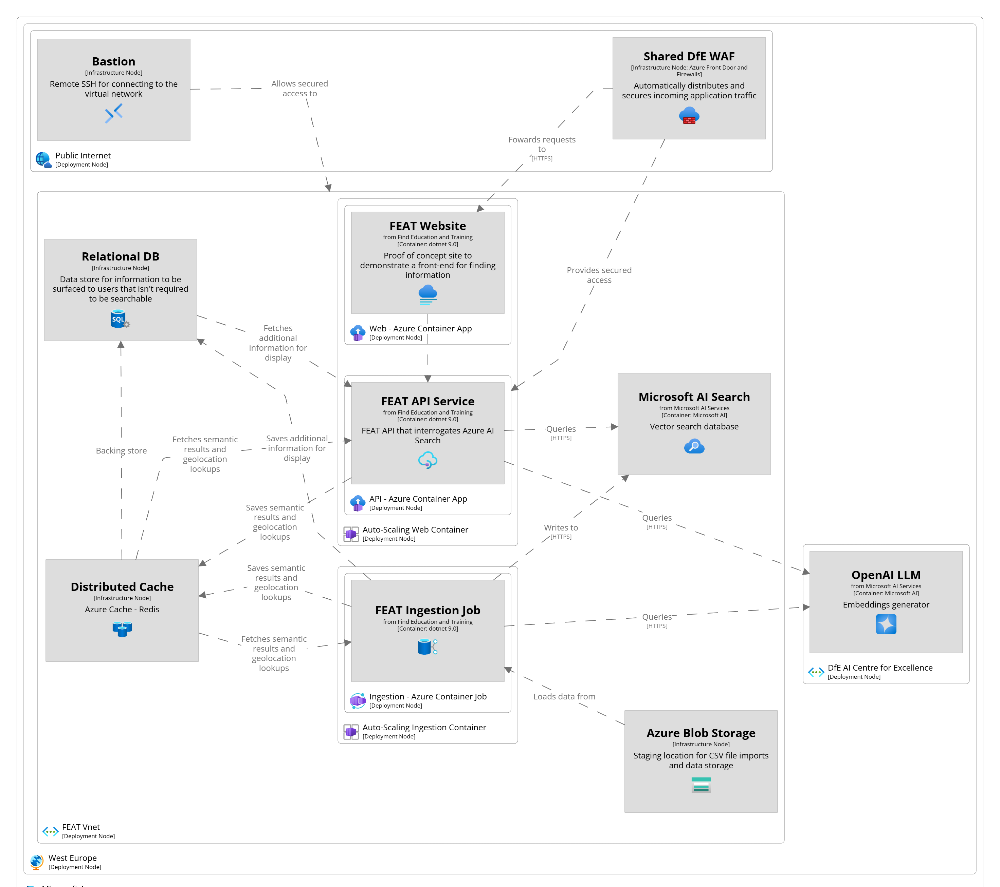

# Application Architecture

## C4: System Landscape

## Component Summary

|      Component       | SLA    |
|:--------------------:|:-------|
|  Azure App Service   | 99.95% |
| Azure Container Apps | 99.95% |
|  Barracuda Firewall  | 99.90% |
| Azure Managed Redis  | 99.99% |
|   Azure SQL Server   | 99.99% |
| Microsoft AI Search  | 99.95% |
| Azure OpenAI Service | 99.99% |

Basion is not included as this is not required for day to day running and is only required for developer access at intermittent times

## Availability

The table shows the composite availability. All Services is for when the entire system is running.

|         Scenario         | Availability |
|:------------------------:|:------------:|
|      All Services        |    99.72%    |
